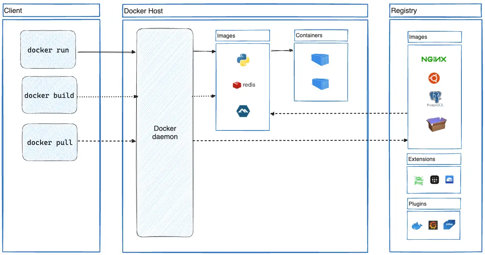
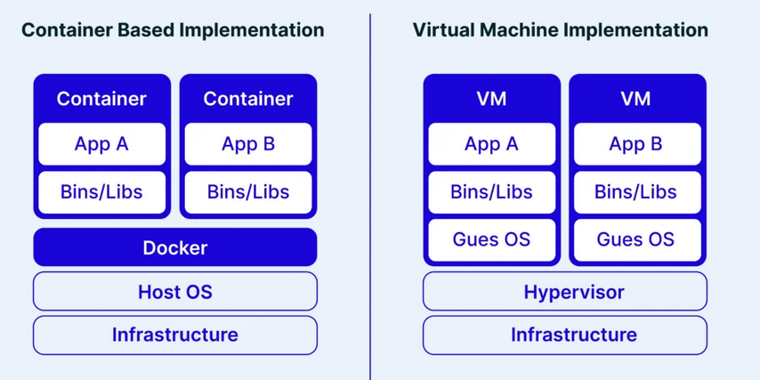
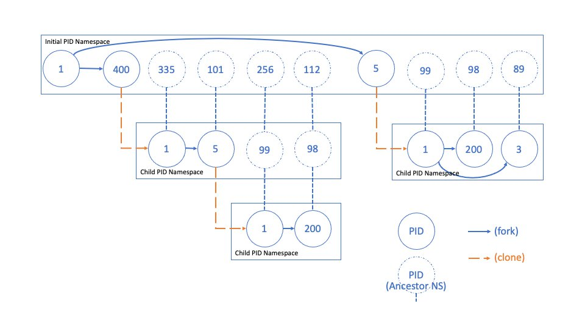
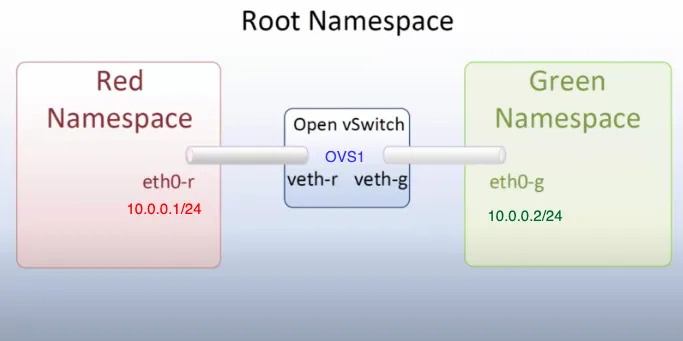

# Docker e Linux Namespaces: Guida Completa alla Containerizzazione

La containerizzazione ha rivoluzionato il modo in cui sviluppiamo e distribuiamo le applicazioni. In questo articolo esploreremo Docker e i meccanismi fondamentali che rendono possibile l'isolamento dei container: i **namespaces** e i **cgroups** di Linux.

## Cos'è Docker?

Docker è una piattaforma open-source che semplifica lo sviluppo, la distribuzione e l'esecuzione delle applicazioni tramite l'uso di **container**. Un container è un'astrazione che permette di racchiudere un'applicazione e tutte le sue dipendenze in un ambiente isolato e portatile, eliminando le incompatibilità dovute alle differenti configurazioni dei sistemi host.

### Caratteristiche Principali

**Isolamento e Portabilità**: Ogni container contiene tutto il necessario per eseguire l'applicazione, garantendo che il software venga eseguito sempre allo stesso modo su qualsiasi infrastruttura.

**Efficienza e Leggerezza**: I container offrono un consumo minore di risorse rispetto alle tradizionali macchine virtuali, condividendo il kernel dell'host.

**Uniformità di Gestione**: Il container diventa la nuova "unità fondamentale" durante il ciclo di vita dell'applicativo, riducendo il tempo che intercorre tra la scrittura del codice e la messa in esercizio.

## Casi d'Uso Principali

### 1. Rilascio Rapido e Coerente delle Applicazioni

Docker elimina il problema del "funziona sulla mia macchina" attraverso:

- **Sviluppo in ambienti isolati**: Ogni sviluppatore lavora in un ambiente standardizzato
- **Testing uniforme**: I container sono identici in ogni ambiente, garantendo test affidabili
- **Aggiornamenti rapidi**: Le modifiche possono essere immediatamente testate e distribuite

### 2. Deploy e Scalabilità Reattivi

La flessibilità di Docker si manifesta in:

- **Portabilità totale**: I container possono essere eseguiti su qualsiasi infrastruttura (PC, server fisici, macchine virtuali, cloud, ambienti ibridi)
- **Scalabilità dinamica**: Possibilità di avviare o terminare istanze in tempo reale per rispondere alle variazioni del carico

### 3. Massimizzazione delle Risorse Hardware

L'efficienza dei container permette:

- **Maggiore densità**: Numerosi container possono essere eseguiti sullo stesso server
- **Riduzione dei costi**: Uso più efficiente dell'hardware si traduce in minori costi infrastrutturali

## Architettura Docker


> Architettura dei componenti principali di Docker

L'architettura di Docker si basa su tre componenti principali:

### Docker Client
L'interfaccia primaria per interagire con Docker. Il comando `docker` invia le richieste al Docker daemon e può comunicare con più daemon contemporaneamente.

### Docker Host
Il sistema su cui gira il Docker daemon (`dockerd`), responsabile di:
- Ascoltare le richieste API
- Gestire gli oggetti Docker (immagini, container, reti, volumi)
- Coordinare i servizi distribuiti

### Docker Registry
Il sistema di archiviazione e distribuzione delle immagini Docker. Docker Hub è il registry pubblico predefinito, ma è possibile configurare registry privati.

### Flusso di Esecuzione di un Container

Quando eseguiamo `docker run`, Docker esegue questi passaggi:

1. **Risoluzione dell'immagine**: Verifica la disponibilità locale, altrimenti effettua il pull dal registry
2. **Creazione del container**: Istanzia un nuovo container basato sull'immagine specificata  
3. **Configurazione del filesystem**: Aggiunge un layer scrivibile sopra l'immagine read-only
4. **Setup networking**: Configura l'interfaccia di rete e l'indirizzamento IP
5. **Avvio del processo**: Esegue il comando specificato come processo principale

## Docker vs Virtual Machine


> Comparazione dello stack usato da Docker e dai sistemi di virtualizzazione

La differenza fondamentale tra containerizzazione e virtualizzazione risiede nell'architettura:

**Virtualizzazione**: Crea macchine virtuali complete con proprio sistema operativo tramite hypervisor. Offre isolamento rigoroso ma con overhead elevato.

**Containerizzazione**: I container condividono il kernel dell'host, isolandosi tramite namespaces e cgroups. Riduce drasticamente l'overhead ma offre isolamento meno robusto.

Questa scelta architettuale determina un compromesso tra sicurezza/isolamento completo e agilità/efficienza.

## Linux Namespaces: Il Cuore dell'Isolamento

I **namespaces** sono un meccanismo del kernel Linux che permette di creare ambienti isolati per processi e risorse. Ogni processo può avere una visione limitata del sistema, accedendo solo alle risorse assegnate.

### Tipi di Namespace

Linux supporta otto tipi di namespace:

- **Mount (mnt)**: Isola i punti di montaggio dei filesystem
- **Process ID (pid)**: Separa gli ID di processo
- **Network (net)**: Isola le risorse di rete
- **Interprocess Communication (ipc)**: Separa le risorse IPC
- **UTS (uts)**: Permette di modificare hostname e domain name
- **User (user)**: Fornisce separazione tra ID utente e gruppo
- **Cgroup (cgroup)**: Isola la visibilità dei gruppi di controllo
- **Time (time)**: Consente separazione degli orologi di sistema

### PID Namespace

I namespace di tipo PID permettono di isolare i processi, assegnando loro identificativi (PID) distinti rispetto ad altri namespace. Di default, un sistema Linux esegue tutti i processi all'interno di un unico namespace PID, rendendoli reciprocamente visibili. È però possibile creare namespace PID annidati, ottenendo gruppi di processi isolati dal resto del sistema.

Questa caratteristica è cruciale nella gestione dei container, dove ogni istanza può avere un proprio processo di init con PID 1, senza interferire con altri container né con l'host.

A differenza di altri namespace, quelli di tipo PID sono organizzati gerarchicamente: ogni namespace ha un padre, e i processi al suo interno sono visibili dai namespace superiori. Un sistema di mappatura consente a un processo di avere PID diversi a seconda del namespace da cui viene osservato. Questa visibilità permette anche di eseguire syscall su un processo utilizzando il PID valido nel namespace del chiamante.



> Rappresentazione della gerarchia tra processi nel namespace pid

### Network Namespace

L'isolamento delle risorse di rete (come indirizzi IP, tabelle di routing e file di sistema come `/proc/net`) consente a ciascun namespace di rete di avere il proprio stack di rete indipendente. Questo significa che ogni processo all'interno del namespace opera in una sottorete isolata, senza possibilità di comunicare con il resto del sistema, a meno di configurazioni eseguite ad-hoc.

Questo isolamento è un meccanismo essenziale per la sicurezza: impedisce a un processo compromesso di accedere direttamente alla rete del sistema host o di intercettare traffico non autorizzato. In questo modo, eventuali attacchi o compromissioni restano confinati all'interno del namespace di rete.

Nel contesto di Docker, questa tipologia di namespace viene utilizzata per mappare le porte del sistema host su porte interne ai container, permettendo ai servizi interni di essere raggiungibili dall'esterno in modo controllato. Questo consente di esporre solo i servizi necessari, migliorando la sicurezza e la gestione delle connessioni.


> Esempio comunicazione tramite network namespace

È inoltre possibile creare reti virtuali condivise tra un gruppo ristretto di processi, consentendo loro di comunicare tra loro senza esporli all'esterno. Un esempio di questo comportamento è illustrato nella figura precedente. Allo stesso modo, si possono configurare reti che permettono la comunicazione tra namespace diversi, facilitando l'interazione tra container o processi isolati pur mantenendo un elevato livello di sicurezza e modularità.

## CGroups: Controllo delle Risorse

I *cgroups* (control groups) sono una funzionalità del kernel Linux che consente di limitare, monitorare e isolare l'uso delle risorse di sistema (come CPU, memoria, I/O su disco e rete) tra gruppi di processi.

Grazie ai *cgroups*, è possibile definire quote e priorità, impedendo che un singolo processo monopolizzi le risorse del sistema e garantendo un migliore isolamento tra applicazioni.

I *cgroups* sono gestiti tramite un'interfaccia a livello di filesystem, tipicamente montata sotto `/sys/fs/cgroup/`. Ogni gerarchia di *cgroups* corrisponde a una directory, con sottodirectory che rappresentano i diversi gruppi di controllo. All'interno di queste directory, file speciali permettono di configurare i limiti e ottenere statistiche sulle risorse consumate dai processi appartenenti al gruppo. Ad esempio, scrivendo un valore nel file `memory.max`, è possibile impostare un limite massimo di memoria per i processi del gruppo.

Questa tecnologia è ampiamente utilizzata in ambienti containerizzati per garantire un uso efficiente delle risorse e migliorare l'isolamento tra container.

A livello concettuale possiamo gestire le seguenti categorie di risorse:

- **Memoria**: possiamo tenere traccia del consumo di memoria (es. quantitativi massimi, possibilità di usare swap). I limiti possono essere soft, in cui la memoria viene reclamata in caso di necessità, oppure hard, in cui il superamento scatena un OOM Killer;
- **CPU**: tiene traccia del consumo di CPU. Possiamo impostare dei limiti che, se superati, causano throttle sulle CPU che eseguono i processi "problematici";
- **Blkio**: tiene traccia delle operazioni di I/O. In caso di letture/scritture eccessive, è in grado di applicare throttling;
- **Network**: possiamo limitare il traffico di rete;
- **Device**: possiamo limitare quali dispositivi un processo è in grado di scrivere.


---

## Demo Pratiche
### Demo 1: Esplorare i PID Namespace

Questa demo illustra come i container sono processi isolati nell'host:

```bash
# 1. Avviare un container Ubuntu con una shell interattiva
docker run -it --name pid-demo ubuntu bash

# 2. Nel container, avviare un processo distintivo
# (dalla shell del container)
watch -n 1 'ps aux | head -10'

# 3. Da un'altra shell sull'host, identificare il processo
ps aux | grep watch

# 4. Analizzare la gerarchia dei processi
CONTAINER_PID=$(docker inspect --format '{{.State.Pid}}' pid-demo)
pstree -p $CONTAINER_PID

# 5. Verificare il mapping dei namespace
ls -la /proc/$CONTAINER_PID/ns/
grep -E 'NSpid|NStgid' /proc/$CONTAINER_PID/status

# 6. Terminare il processo dall'host (dimostra che sono lo stesso processo)
kill $CONTAINER_PID
# Il container si fermerà
```

### Demo 2: Network Namespace e Port Mapping

Questa demo mostra il funzionamento dell'isolamento di rete:

```bash
# 1. Avviare un container con port mapping
docker run -d -p 8080:80 --name web-demo nginx

# 2. Verificare il mapping delle porte
docker port web-demo
ss -tlnp | grep :8080

# 3. Ottenere il PID del container
CONTAINER_PID=$(docker inspect --format '{{.State.Pid}}' web-demo)

# 4. Confrontare i network namespace
ls -l /proc/1/ns/net      # Host namespace
ls -l /proc/$CONTAINER_PID/ns/net  # Container namespace

# 5. Testare la connettività
curl localhost:80         # Fallisce - porta non esposta sull'host
curl localhost:8080       # Funziona - porta mappata

# 6. Accedere al namespace del container
nsenter --target $CONTAINER_PID --net --mount --pid bash
# Ora siamo "dentro" il container
curl localhost:80         # Funziona - siamo nel namespace del container
```

### Demo 3: CGroups e Limitazione delle Risorse

Questa demo mostra il controllo delle risorse tramite cgroups:

```bash
# 1. Creare un container con limiti di memoria
docker run -it --memory=100m --name memory-demo ubuntu bash

# 2. Trovare il cgroup del container
CONTAINER_ID=$(docker inspect --format '{{.Id}}' memory-demo)
cat /sys/fs/cgroup/memory/docker/$CONTAINER_ID/memory.limit_in_bytes

# 3. Test di allocazione memoria normale (dalla shell del container)
python3 -c "
data = []
for i in range(50):
    data.append(b'0' * (1024 * 1024))  # 1MB per iterazione
    print(f'Allocated {i+1} MB')
"

# 4. Test che supera il limite (dovrebbe fallire)
python3 -c "
data = []
for i in range(150):
    data.append(b'0' * (1024 * 1024))  # Tenta di allocare 150MB
    print(f'Allocated {i+1} MB')
"
# Il processo verrà terminato dal kernel OOM killer

# 5. Verificare i log del sistema
dmesg | tail -n 20 | grep -i "killed process"
```

### Demo 4: Monitoraggio Real-time delle Risorse

```bash
# 1. Avviare un container con stress testing
docker run -d --name stress-demo --memory=200m --cpus=0.5 ubuntu \
  bash -c "apt update && apt install -y stress && stress --cpu 2 --memory 1 --memory-bytes 150M"

# 2. Monitorare l'utilizzo delle risorse
docker stats stress-demo

# 3. Ispezionare i cgroup files direttamente
CONTAINER_ID=$(docker inspect --format '{{.Id}}' stress-demo)
watch -n 1 "cat /sys/fs/cgroup/memory/docker/$CONTAINER_ID/memory.usage_in_bytes"

# 4. Analizzare le statistiche CPU
cat /sys/fs/cgroup/cpu/docker/$CONTAINER_ID/cpu.stat
```

## Conclusioni

Docker rappresenta una rivoluzione nel deployment delle applicazioni, combinando efficienza, portabilità e semplicità d'uso. La comprensione dei meccanismi sottostanti - namespaces e cgroups - è fondamentale per utilizzare al meglio questa tecnologia.

I namespaces forniscono l'isolamento necessario per far credere a ogni container di essere l'unico sul sistema, mentre i cgroups garantiscono che le risorse siano distribuite equamente e in modo controllato.

Questa combinazione rende Docker ideale per ambienti cloud-native, microservizi e pipeline CI/CD, dove l'agilità e l'efficienza sono requisiti fondamentali.
